# User Manual for RiceMapEngine

_Author: Zhiqi Yu_  
_Date: 6/24/2022_

## 1. Introduction

The RiceMapEngine is a web application that uses Google Earth Engine APIs to perform rice mapping with remote sensing. 

This application mainly includes three sub-applications, namely Phenology Explorer (PE), Empirical Thresholding (ET), and Supervised Classification (SC), that serve different purposes in the workflow of rice mapping. 

Specifically, PE provides functions to inspect ground truth samples by the phenology information acquired from remote sensing. By identifying phenology stages of ground truth samples based on remote sensing-generated phenology information, users can identify true rice samples and false rice samples, which should be removed for further analysis. The PE also generates empirical thresholds from ground truth samples for user-defined phenology phases. 

The ET and SC are two methods for rice classification. ET allows rice mapping using empirical thresholds. Thresholds represent value ranges for the remote sensing images within certain phenological phases. The thresholds can be generated from PE or from previous experience. The classification result is generated simply by determine if a pixel value is within the provided value range. Ground truth samples are not required for this method.

SC is the good old supervised classification method that trains machine learning models with ground truth samples and classify remote sensing images to rice maps. Ground truth samples are required for this method. 

Following sections give details of each sub-application.

## 2. Phenology Explorer (PE)

The UI of PE is shown in the following figure:

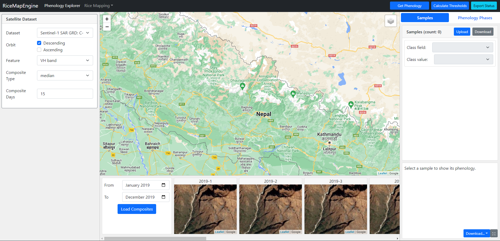

The overall UI is divided into several panels. 

### 2.1. Left Panel

The left panel UI allows users to select what and how satellite images are used to extract phenology information. 

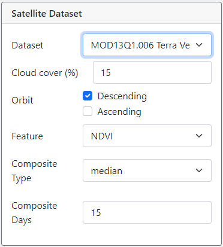

These parameters are available for customization:

- The data source, i.e., what satellite data to use, can be radar or optical data.
- Cloud cover (only relevant for optical data source), i.e., the maximum **percentage** of cloud cover allowed on each image.
- Orbit, ascending and/or decending. 
- Feature, i.e., a single number to compute from original bands, can be the raw band values, or indices like NDVI, etc.
- Composite Type. This is the aggregation method to use for making image composites. **Note:** The composite is necessary because the study area can span across multiple swaths, which cause images to have different collection time.
- Composite Days. This is the number of days as intervals to make composites. Together with composite type, this defines how the image composites will be made. 

### 2.2. Middle Panel

The middle panel is divided into two areas, one being a map for visualization, and another to show monthly false color composites to assist inspecting phenology information.

In the bottom area, users can define the overall date range for phenology inspection. For demonstration purpose, the figure below selects the date range to be from the start of January 2019 to the end of March 2019, and correspondingly, three maps that correspond to each of the three months will be shown. Clicking the "Load Composites" button will load 30-day false color composite from Sentinel-2 or Landsat-8. 

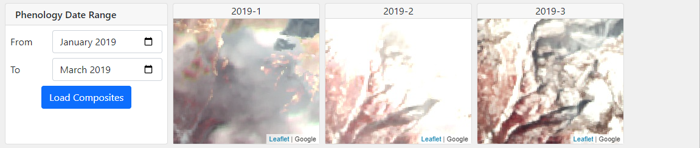

After ground truth samples are loaded into the application, and a sample is selected, all the maps will center around the selected sample automatically. 

### 2.2. The right panel 

The right panel includes two tabs, namely **Samples** and **Phenology Phases**. The sample tab as shown in the figure below includes a list of ground truth samples uploaded to the application, and a chart that shows time-series satellite image data that assumbly captures critical phenology information. The phenology phases as shown in the second figure below allows users to set up the date ranges of phenology phases, and acquire thresholds for those phases according to the satellite image data. 

#### 2.2.1. Sample tab

The sample tab is shown in figure below. 

**Ground truth sample upload/download**

Users use the **Upload** button to load the ground truth samples to the application. The accepted file should be a **zipped** shapefile. The **Download** button can be used to download the modified version of ground truth samples from the application.

Once the ground truth samples are loaded in the application, several things will happen:

1. The samples will be shown on the map.
2. A list of samples will show in the panel

In the sample container, there are two parameters that are necessary:

- Class field: the property name from each sample that represents the class of the sample.
- Class value: the literal value of the "class field" that represents the rice class.

Changing the class field and class value has several effects:

1. The title of each sample in the list will change to the value of the selected class field of each sample. For example, in the figure, the first sample's "Land_cover" field value is "Rice", thus the title, 
2. The samples that matches the selected class field and class values will be highlighted. For example, because "Rice" is selected as the target class, the first sample is highlighted in light green color.
3. The color of samples shown on the map will change to reflect the classes. Target classes will be red, and non-target classes will be blue. 

The figure below shows how the app will look like when a sample is selected:

**Phenology Inspection**

After the sample is loaded into the application, users can click the "Get Phenology" button to the top right corner of the header. This will sample from satellite images at ground truth samples locations and attach satellite image data values to each sample. Then, users can click on samples in the list to see the time-series satellite data values on the chart area. 

The figure below shows how the figure will look like once a sample is selected:

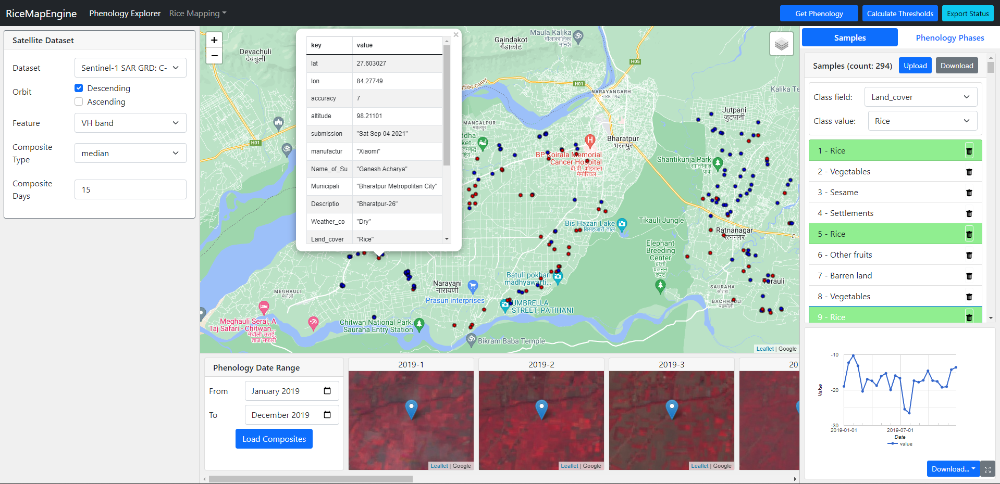

***Note**: You need to re-select a sample to see the chart after the "Get Phenology" step finishes.* 

#### 2.2.2. Phenology Phases tab

In the "phenology phases" tab, users can edit names and date ranges of phenology phases as they like. The figure below shows how to add, delete, and edit a phenology phase. Note that the threshold values are not editable as they will be calculated automatically. 

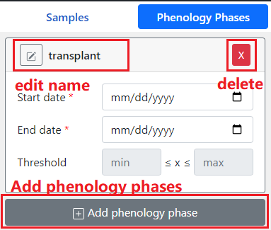

**Calculate thresholds for phenology phases**

After defining the time frame of each phenology phases, users can click the "Calculate Thresholds" button to calculate the threshold values using the chosen satellite image data and all the target class ground truth samples. The algorithm to calculate the thresholds are as follows:

- For each of the phenology phases:
  - For all ground truth samples that belong to the target class:
    - Get satellite data values within the time frame
    - Remove outliers using [interquartile method](https://en.wikipedia.org/wiki/Interquartile_range#:~:text=The%20interquartile%20range%20is%20often,or%20above%20Q3%20%2B%201.5%20IQR.).
    - Set the minimum to be [mean - std.dev] and max to be [mean + std.dev].

## 3. Empirical Thresholding (ET)

The ET is the first method of rice classification. The overall UI is divided into three parts as the same as PE. 

### 3.1. Left Panel

The left panel contains the same parameter settings as PE plus additional UI controls that specify auxiliary datasets to be used. The auxiliary datasets include:

- Boundary. Users can select from the preset boundaries of the Terai belt districts of Nepal, or they can upload their own boundary file as a **zipped shapefile**.
- Crop Mask. Whether to use a crop mask. By detault, this is checked on, and users can input the ID of a **public GEE asset** (see [this guide](https://developers.google.com/earth-engine/guides/asset_manager) on how to make an asset public) to specify which crop mask to be used.

### 3.2. Right Panel

The right panel, as shown in the figure below, is similar to the "Phenology Phases" tab from the right panel of PE. 

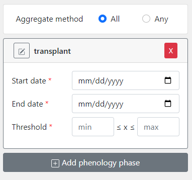

- Aggregated method. This is allowing users to specify if all the thresholds of phenology phases should be matched or at least one of them should be matched. "All" means all phases need to be satisfied and "Any" means at least one needs to be satisfied.
- Thresholds. Node that thresholds of each phenology phases are editable. If the thresholds were already calculated in PE, then they will show in ET as well.

### 3.3. Mid Panel

The middle panel contains the same map and a bottom area. The bottom area is to show a log of activities, which include activities in both ET and SC. 

Specifically, the logs will record the time when a classification attempt is made and what parameters are set that conducted the classification. 

The figure below shows two logs after conducting a rice mapping task using ET. The first log records all parameters in JSON format, and once the classifiaction is finished, the second log shows the rice area.

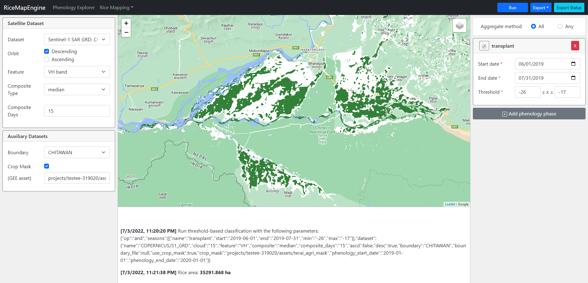

### 3.4. Top bar

There are three buttons on the top bar for ET. 

- Run. After all parameters are properly set, clicking this button will execute the ET algorithm to produce rice map. 
- Export
  - Download as thumbnail: this button will be disabled if no successful rice classification is conducted. Once a rice mapping task is finished, this button will be clickable, and users can view the classification result in a JPEG figure with the maximum dimension as 1980 pixels.
  - Export to Google Drive: this button is to be used when the classification results need to be retrieved in their original spatial resolution. It is recommended to fine tune parameters before exporting results. Running the export will return a unique task ID that can be used to check task status later. This function will be explained in detail later.
  - Export Status: click this button to show a search bar, where users can check their task status by inputing their task ID. This will be explained later.

## 4. Supervised Classification

SC is another method of rice mapping. This method uses ground truth data to train machine learning models, which will be used to produce rice maps. 

### 4.1. Left Panel

In addition to the satellite data-related parameters and auxiliary dataset parameters, SC include more parameters related to machine learning models and the training process. 

- Image Date Range. Users can specify the start date and end date to select satellite images from. 
- Training ratio. The ratio of the ground truth data to be used for training. Default is 0.7, which means a randomly selected 70% of the data will be used for training, and the rest 30% is held out for testing.
- Model. This is the model to be chosen from. Currently only supporting Random Forest. The detailed parameters of the Random forest model can be set after selecting "Random Forest". The explanation of those parameters can be seen by clicking the info icon next to the name of the parameter.

### 4.2. Right Panel

The right panel is exactly the same as the sample container as described in [2.2.1.](#221-sample-tab)

**Note** that while the "class field" and "class value" are not required to be set in PE, they are required to make SC work.

### 4.3. Mid Panel

The mid panel is exactly the same as the mid panel as described in [3.3.](#33-mid-panel)

In addition to the area of rice, the log panel of SC also shows the model testing results including the confusion matrix, overall accuracy, and the Cohen's Kappa score. Axis 0 (the rows) of the matrix correspond to the actual values, and Axis 1 (the columns) to the predicted values, and 0 means non-rice and 1 means rice. The figure below shows an example of the log after performing a successful rice mapping using SC:

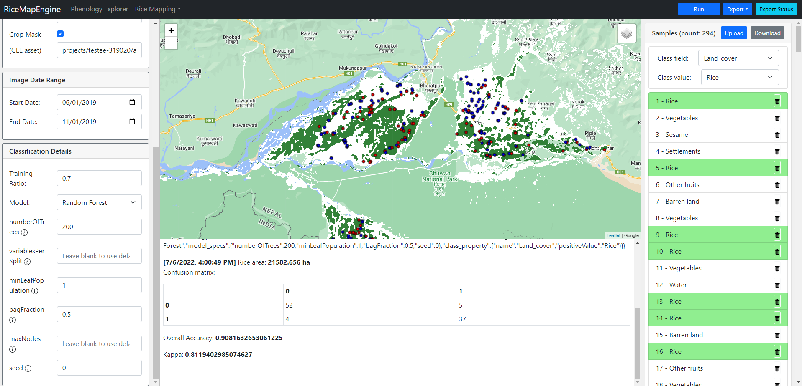

### 4.4. Top bar

The top bar of SC is exactly the same as ET. 

# 5. Exporting

**Start an export task**

Export function is available for ET and SC. Export is a function that is similar to the export function in GEE online code editor. It allows retrieving processing results in its original spatial resolution even if the processing is complicated and file size is large with a sacrifice of time. 

In RiceMapEngine, the exporting function can be accessed by clicking the "Export" -> "Export to Google Drive" button. Clicking this button will run the classification algorithm with the parameters that are set in the app and no results will be shown on the map. Instead, a unique ID will be generated for the export task. The ID will look like in the figure below:

**Check task status**

To check the status of a task created before, users can click the "Export Status" button on the top right of the app. A dialog will be opened which contains a search bar:

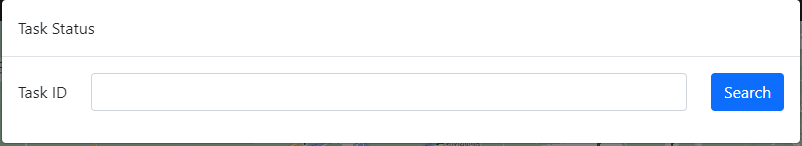

Users can input the generated ID into the search bar to check the status of that task. For example, below is the status of the task we created just now:

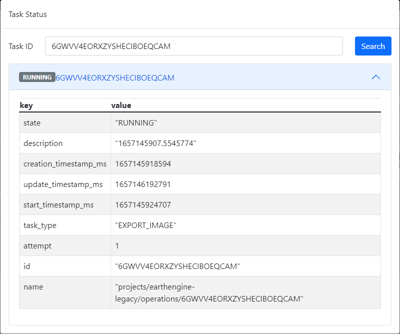

Note that the badge before the task ID in the figure shows "Running", which means the task is currently running on the Google Cloud. There are many more task status that you may see, check [here](https://developers.google.com/earth-engine/guides/processing_environments#list-of-task-states) for a complete list of status a task may have.

Once a task is completed, users can see a download button, which can be used to download the result as a GeoTIFF file to the local machine.

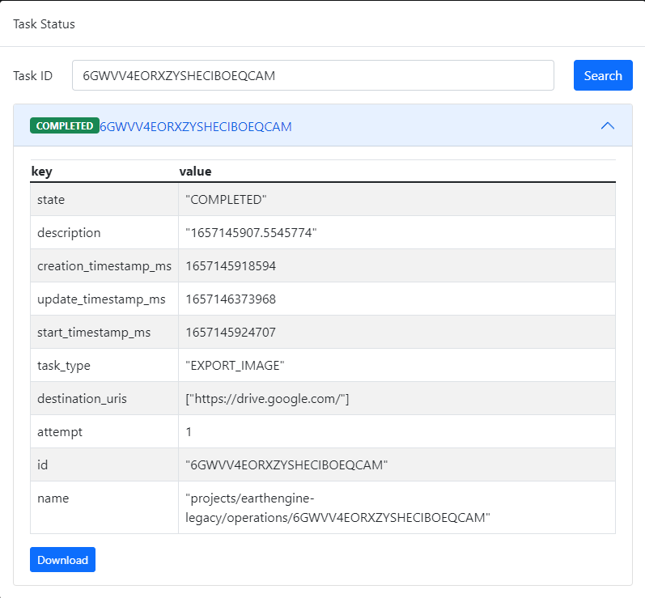

